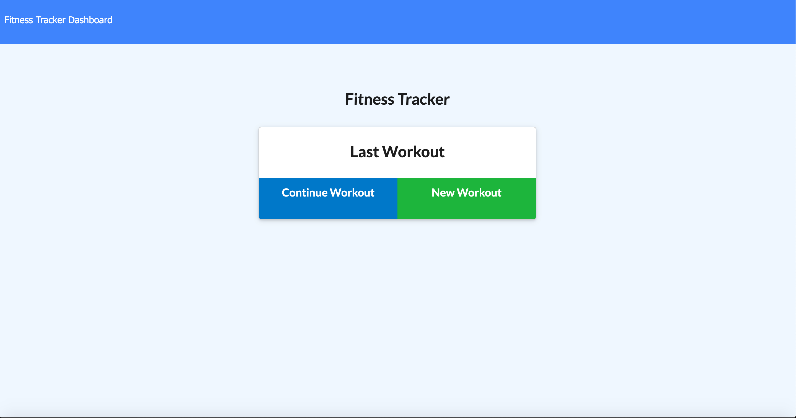
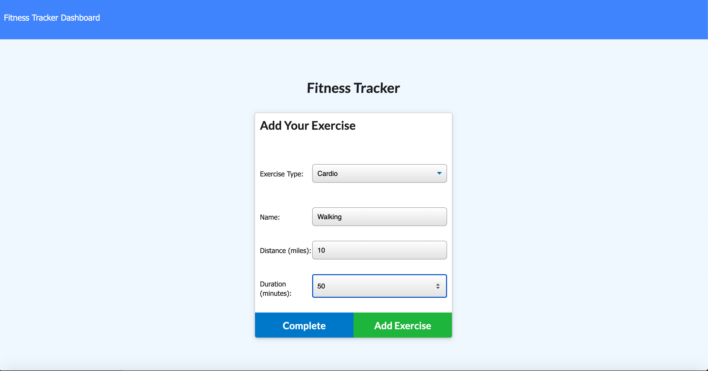
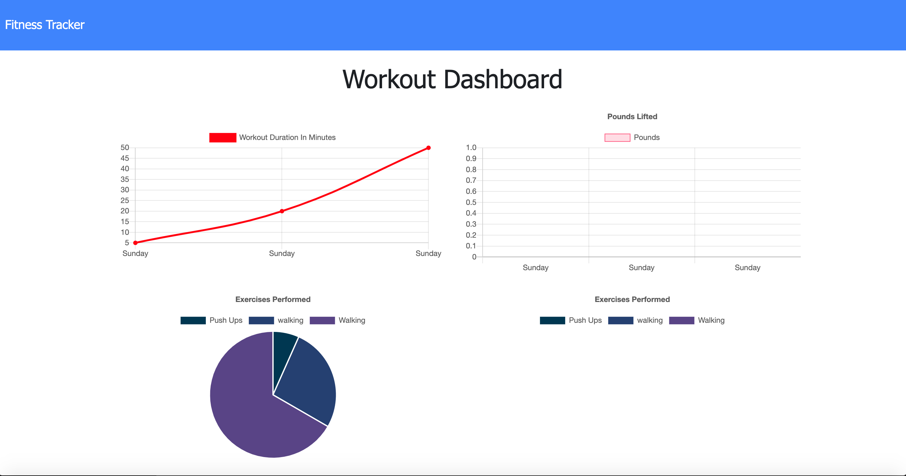

# WorkOut Tracker
# Description
This project is made for user so he/she can create, track and view her/his daily workout. The user will be able to log multiple exercises in a given day. User will also be able to track name, type, weight, sets, reps, and duration of the exercise. When Cardio exercise is picked the user will be able to track distance travelled.

Deployed app can be access [here](https://polar-hollows-80827.herokuapp.com/).
# Table Of Contents
  * [Description](#description)
  * [Installation](#installation)
  * [Usage](#usage)
  * [License](#license)
  * [Contributing](#contributing)
  * [Tests](#tests)
  * [Questions](#questions)
# Installation
npm install
# Usage
npm start
# Licence 
MIT
# Contributors
grace
# Test 

# Questions 
 
For more information you can check my Github account Gracee19(https://github.com/Gracee19). 
Please don't hesitate to ask questions you can email me at .
